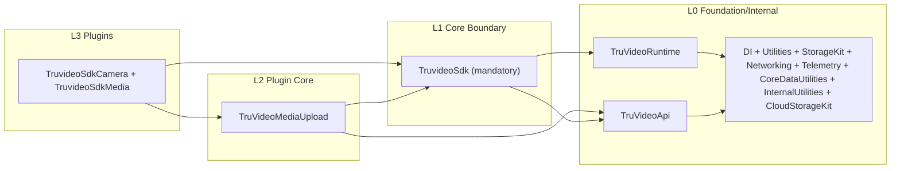

# TruVideoSDK

A modular iOS SDK built with Swift, featuring a layered architecture with Foundation, Internal, and App layers for different functionalities.

## Table of Contents

- [Prerequisites](#prerequisites)
- [Quick Start](#quick-start)
- [Project Structure](#project-structure)
- [Documentation](#documentation)
- [Coding Style](#coding-style)
- [Code Formatting](#code-formatting)
- [Available Commands](#available-commands)
- [Framework Dependencies](#framework-dependencies)
- [XCFramework Creation](#xcframework-creation)
- [Running Unit Tests](#running-unit-tests)
- [Release Process](#release-process)
- [Contributing](#contributing)
- [Sample Projects](#sample-projects)

## Prerequisites

- **Xcode 15.0+** (iOS 15.0+ deployment target)
- **XcodeGen** - Install via Homebrew: `brew install xcodegen`
- **SwiftLint** - Install via Homebrew: `brew install swiftlint`
- **Make** - Usually pre-installed on macOS

## Quick Start

### 1. Clone the Repository
```bash
git clone git@github.com:Truvideo/truvideo-ios-sdk.git
cd truvideo-ios-sdk
```

### 2. Generate and Build
```bash
# Generate Xcode project, build all frameworks, and open Xcode
make genbuild
```

That's it! The project will be generated, all frameworks built, and Xcode will open automatically.

## Project Structure

```
truvideo-ios-sdk/
├── Libraries/
│   ├── Foundation/
│   │   ├── Core/
│   │   │   ├── DI/
│   │   │   ├── Registry/
│   │   │   ├── Storage/
│   │   │   └── Utilities/
│   │   └── Extended/
│   │       ├── CoreDataUtilities/
│   │       └── Telemetry/
│   ├── Internal/
│   │   ├── Core/
│   │   │   └── Networking/
│   │   └── Extended/
│   │       ├── CloudStorage/
│   │       └── TruVideoApi/
│   ├── External/
│   │   └── Extended/
│   │       └── App/
│   └── Plugins/
│       ├── Camera/
│       └── Example/
├── docs/
│   ├── external/          # User-facing documentation (QA, use cases, telemetry)
│   ├── internal/          # Developer-facing specs and internal docs
│   ├── release-process.md
│   └── swift-style-guide.md
├── project.yml
├── Makefile
└── README.md
```

### Architecture Layers

The SDK is organized into five distinct layers:

#### 🏗️ Foundation Layer
**Purpose**: Low-level infrastructure and utilities
- **Core**: Basic infrastructure (DI, Registry, StorageKit, Utilities)
- **Extended**: Higher-level utilities built on Core (CoreDataUtilities, Telemetry)

#### 🔧 Internal Layer  
**Purpose**: Business logic infrastructure
- **Core**: Core business logic (Networking)
- **Extended**: Business-specific implementations (TruVideoApi, CloudStorageKit)

#### 📱 External Layer
**Purpose**: Main SDK interface and public API
- **Sources**: Main SDK components and entry points (TruVideoSdk)

#### 🎥 Plugins Layer
**Purpose**: Optional feature modules that extend SDK functionality
- **Camera**: Camera and media capture functionality (TruvideoSdkCamera)

## Documentation

### 📁 Documentation Structure

The project documentation is organized into two main categories:

#### 📖 External Documentation (`docs/external/`)
**Purpose**: User-facing and QA documentation
- **Camera Module**: Telemetry events, use cases, and test scenarios
  - `telemetry/` - Event tracking specifications by screen/feature
  - `usecases/` - Test use cases organized by camera functionality

#### 🔧 Internal Documentation (`docs/internal/`)
**Purpose**: Developer-facing technical specifications
- **Feature Specifications**: Detailed technical documentation (e.g., Stream Upload)
- **Internal Guidelines**: Team-specific documentation and processes

#### 📚 General Documentation
- **[Swift Style Guide](docs/swift-style-guide.md)** - Coding standards and guidelines
- **[Release Process](docs/release-process.md)** - Release workflow and versioning

### 📚 Framework Documentation
Each framework includes comprehensive documentation for its specific functionality:

#### Foundation Layer
- **[DI Framework](Libraries/Foundation/Core/DI/Sources/DI.docc/DI.md)** - Dependency injection system
- **[Registry](Libraries/Foundation/Core/Registry/Sources/Core.docc/Core.md)** - Library registry system
- **[StorageKit](Libraries/Foundation/Core/Storage/Sources/Storage.h)** - Storage abstractions and implementations
- **[Utilities](Libraries/Foundation/Core/Utilities/Sources/Utilities.h)** - Common utilities and extensions
- **[CoreDataUtilities](Libraries/Foundation/Extended/CoreDataUtilities/Sources/CoreDataUtilities.docc/CoreDataUtilities.md)** - Core Data helper utilities
- **[Telemetry](Libraries/Foundation/Extended/Telemetry/Sources/Telemetry.docc/README.md)** - Analytics and telemetry system

#### Internal Layer
- **[Networking](Libraries/Internal/Core/Networking/Sources/Networking.h)** - Network layer and HTTP client
- **[TruVideoApi](Libraries/Internal/Extended/TruVideoApi/Sources/TruVideoApi.h)** - TruVideo API client and authentication
- **[CloudStorageKit](Libraries/Internal/Extended/CloudStorage/Sources/CloudStorage.h)** - Cloud storage abstractions and implementations

#### External Layer
- **[TruVideoSDK](Libraries/External/Extended/App/Sources/TruVideoSdk.swift)** - Main SDK entry point and public API

#### Plugins Layer
- **[TruvideoSdkCamera](Libraries/Plugins/Camera/Sources/TruvideoSdkCamera.docc/TruvideoSdkCamera.md)** - Camera and media capture functionality

## Coding Style

See [docs/swift-style-guide.md](docs/swift-style-guide.md) for our comprehensive coding standards and guidelines.

## Code Formatting

To ensure code consistency across the project, we use the official [swift-format](https://github.com/apple/swift-format) tool.

**All code is automatically formatted on build**, but you can also run it manually before creating a pull request (PR):

```bash
swift-format format -r Libraries -i
```

> **Tip:** You can also format the entire project by running the above command from the project root.

GitHub Actions will verify that any code changes are style-compliant. Please make sure your code is formatted before submitting a PR.

**Install swift-format:**
```bash
brew install swift-format
```

## Available Commands

### 🚀 Quick Start Commands
```bash
make genbuild          # Generate, build, and open Xcode project (recommended)
make generate          # Generate Xcode project using XcodeGen
make open              # Open Xcode project (after generation)
```

### 🔨 Building Commands
```bash
make build             # Build all frameworks in dependency order
make framework SCHEME=<name>  # Build specific framework as XCFramework
# Available schemes: DI, Registry, StorageKit, Utilities, CoreDataUtilities, Telemetry, Networking, TruVideoApi, CloudStorageKit, TruVideoSdk, TruvideoSdkCamera
```

### 🧪 Testing & Quality
```bash
make test              # Run all unit tests
make lint              # Run SwiftLint for code quality checks
```

### 🛠️ Development Workflows
```bash
make dev               # Clean, generate, and build (development reset)
make all               # Generate, build, and test (full CI workflow)
make clean             # Clean all generated files and build artifacts
```

### 📚 Help & Information
```bash
make help              # Show all available commands with descriptions
```

> **Pro Tip:** Start with `make genbuild` for a complete setup, then use `make framework SCHEME=<name>` for individual framework development.

## Framework Dependencies



### Architecture Flow

The diagram above illustrates the **unidirectional data flow** and dependency relationships:

1. **L0 Foundation/Internal** - Shared infrastructure and internal building blocks
2. **L1 Core Boundary** - Mandatory SDK entry point (`TruvideoSdk`)
3. **L2 Plugin Core** - Shared plugin engine (`TruVideoMediaUpload`)
4. **L3 Plugins** - Feature plugins (`TruvideoSdkCamera`, `TruvideoSdkMedia`)

**Key Principles:**
- **Unidirectional Flow**: Dependencies flow from higher layers to lower layers
- **Separation of Concerns**: Each layer has a specific responsibility
- **Modularity**: Frameworks can be developed and tested independently
- **Scalability**: New features can be added without affecting existing layers
- **Plugin Architecture**: Optional features can be added as separate plugins

## XCFramework Creation

The `make framework SCHEME=<name>` command creates XCFrameworks that work on both device and simulator:

```bash
make framework SCHEME=TruVideoSdk
```

This will:
1. Build the framework for device (iphoneos)
2. Build the framework for simulator (iphonesimulator)
3. Create an XCFramework in `DerivedData/XCFrameworks/`

## Running Unit Tests

Select a scheme and press <kbd>Command</kbd>+<kbd>U</kbd> in Xcode to build a component and run its unit tests.

## Sample Projects

Reference implementations live under `Libraries/Plugins/Example/`:

- [`CameraObjectiveCExample`](Libraries/Plugins/Example/CameraObjectiveCExample) – UIKit sample showing Objective-C interoperability
- [`CameraSwiftUIExample`](Libraries/Plugins/Example/CameraSwiftUIExample) – SwiftUI sample demonstrating configuration and media preview flows

Generate the workspace via `make genbuild`, then select the desired scheme in Xcode to build and run the sample.


## Release Process

For detailed information about our release process, versioning, and GitHub Actions workflows, see [release-process.md](docs/release-process.md).

**Quick Summary**: We use automated workflows to cut internal releases (beta/rc/prod) and publish them to public SDK repositories with proper versioning, changelogs, and XCFramework artifacts.

## Contributing

See [CONTRIBUTING.md](CONTRIBUTING.md) for more information on contributing to the Truvideo iOS SDK.
