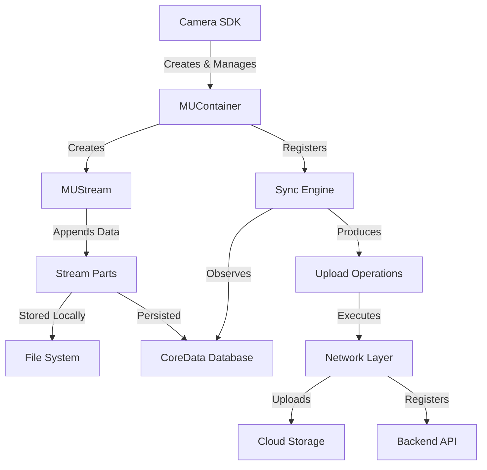
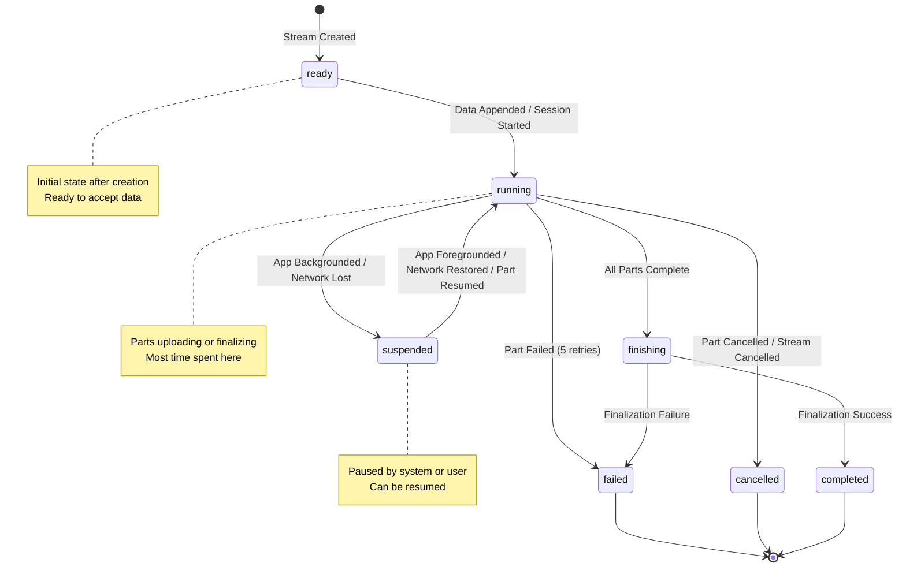
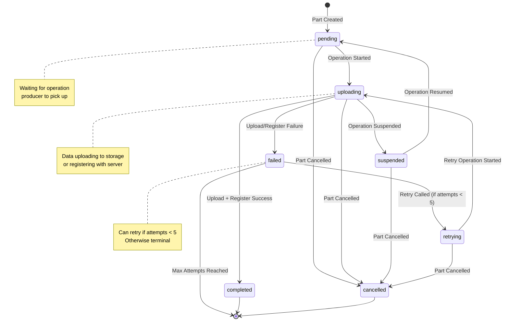

# Stream Upload – Feature Specification

## Document Information

- **Feature Name**: Stream Upload (Multipart Media Upload)
- **Version**: 1.0
- **Last Updated**: [Current Date]
- **Feature Owner**: SDK Team
- **Status**: Implemented
- **Platform**: iOS 15.0+

---

## Executive Summary

The **Stream Upload** feature provides a robust, resumable multipart upload system for media files (photos and videos) in the TruVideo iOS SDK. Instead of uploading entire files as single monolithic transfers, Stream Upload splits media into smaller parts that are uploaded concurrently, enabling better resilience to network interruptions, reduced memory usage, and granular progress tracking.

### Key Benefits

- **Resilience**: Individual part failures don't fail the entire upload immediately
- **Resumability**: Uploads can resume after app termination or network interruptions
- **Memory Efficiency**: Large files are processed in chunks, reducing peak memory usage
- **Progress Tracking**: Granular progress monitoring at both stream and part levels
- **Concurrent Uploads**: Multiple parts upload simultaneously for faster completion

---

## Table of Contents

1. [Feature Overview](#feature-overview)
2. [Architecture](#architecture)
3. [API Specification](#api-specification)
4. [Data Models](#data-models)
5. [State Machines](#state-machines)
6. [Operation Flow](#operation-flow)
7. [Error Handling](#error-handling)
8. [Retry & Resume Logic](#retry--resume-logic)
9. [Performance Characteristics](#performance-characteristics)
10. [Security Considerations](#security-considerations)
11. [Integration Guide](#integration-guide)
12. [Testing Strategy](#testing-strategy)
13. [Known Limitations](#known-limitations)
14. [Future Enhancements](#future-enhancements)

---

## Feature Overview

### Problem Statement

Traditional single-file uploads face several challenges:
- **All-or-nothing failures**: A single network interruption can fail the entire upload
- **Memory pressure**: Large video files must be loaded entirely into memory
- **No granular progress**: Progress tracking is limited to the entire file
- **Poor resume capability**: Resuming requires restarting from the beginning

### Solution

Stream Upload addresses these challenges by:
1. **Splitting files into parts**: Files are divided into manageable chunks (up to 120 parts per stream)
2. **Concurrent part uploads**: Multiple parts upload simultaneously
3. **Independent part retries**: Failed parts retry independently without affecting successful parts
4. **Persistent state**: Stream and part metadata are persisted to CoreData for resume capability
5. **Two-phase upload**: Each part is uploaded to storage, then registered with the server

### Use Cases

- **Video uploads**: Large video files benefit from chunked uploads and resume capability
- **Photo uploads**: Even photos can benefit from multipart uploads for consistency
- **Unstable networks**: Cellular networks with intermittent connectivity
- **Background uploads**: Uploads that may be interrupted by app lifecycle events

---

## Architecture

### High-Level Architecture



### Component Overview

#### MUContainer
- **Purpose**: Central manager for stream lifecycle
- **Responsibilities**:
  - Create new streams
  - Retrieve existing streams
  - Manage active stream cache
  - Coordinate with sync engine
- **Persistence**: Uses CoreData for stream metadata

#### MUStream
- **Purpose**: Represents a single media upload session
- **Responsibilities**:
  - Accept data via `append()` methods
  - Manage stream lifecycle (suspend, resume, cancel, finish)
  - Track stream state
  - Coordinate part creation and management
- **Properties**:
  - `id: UUID` - Unique stream identifier
  - `fileType: FileType` - Type of media being uploaded
  - `status: MUStreamStatus` - Current stream state
  - `mediaId: UUID?` - Server-assigned media identifier
  - `createdAt: Date` - Stream creation timestamp
  - `completedAt: Date?` - Stream completion timestamp
  - `parts: [MUPartHandle]` - Array of all part handles

#### MUPartHandle
- **Purpose**: Manages individual part lifecycle
- **Responsibilities**:
  - Track part state
  - Manage part operations (upload, register)
  - Handle retries
  - Expose part status via Combine publishers
- **Properties**:
  - `id: UUID` - Unique part identifier
  - `number: Int` - Sequential part number (1-based)
  - `status: StreamPartStatus` - Current part state
  - `attempts: Int` - Number of retry attempts
  - `createdAt: Date` - Part creation timestamp

#### Sync Engine
- **Purpose**: Background coordinator for upload operations
- **Responsibilities**:
  - Observe database changes for pending parts
  - Produce upload operations
  - Coordinate operation execution
  - Handle operation dependencies
- **Components**:
  - `RemoteSyncEngine`: Main sync engine implementation
  - `SyncOperationProducer`: Generates operations for parts
  - `OperationQueue`: Executes operations concurrently

#### Operation Types

1. **StartSessionOperation**
   - Initializes multipart upload session with server
   - Must complete before parts can upload
   - Returns `sessionId` and `mediaId`

2. **SyncPartOperation**
   - Coordinates part upload and registration
   - Contains two sub-operations:
     - `UploadDataOperation`: Uploads part data to storage
     - `RegisterPartOperation`: Registers part with server

3. **CompleteStreamOperation**
   - Finalizes multipart upload session
   - Called after all parts are uploaded and registered
   - Signals server to assemble final media file

### Data Flow

```
1. File Created
   ↓
2. MUStream Created (persisted to CoreData)
   ↓
3. File Read in Chunks
   ↓
4. Parts Created (stored locally + persisted to CoreData)
   ↓
5. StartSessionOperation Executes
   ↓
6. Session Created (sessionId + mediaId assigned)
   ↓
7. SyncPartOperations Produced (one per part)
   ↓
8. Parts Upload Concurrently
   ├─→ UploadDataOperation (uploads to storage, gets eTag)
   └─→ RegisterPartOperation (registers with server)
   ↓
9. All Parts Complete
   ↓
10. CompleteStreamOperation Executes
   ↓
11. Stream Finalized → Status: .completed
```

---

## API Specification

### MUContainer API

#### Creating Streams

```swift
/// Creates a new stream for uploading media of the specified file type.
///
/// - Parameter fileType: The type of media file that will be uploaded
/// - Returns: A new MUStream instance ready to accept data
/// - Throws: UtilityError if stream creation fails
func newStream(of fileType: FileType) async throws -> MUStream
```

**Usage:**
```swift
let container = MUContainer()
let stream = try await container.newStream(of: .mp4)
```

#### Retrieving Streams

```swift
/// Retrieves streams from the database, optionally filtered by a predicate.
///
/// - Parameter isIncluded: Closure that determines whether a stream should be included
/// - Returns: Array of MUStream instances matching the filter, sorted by creation date
/// - Throws: UtilityError if retrieval fails
func retrieveStreams(where isIncluded: (MUStream) -> Bool = { _ in true }) async throws -> [MUStream]
```

**Usage:**
```swift
// Get all active streams
let activeStreams = try await container.retrieveStreams { stream in
    stream.status == .running || stream.status == .ready
}

// Get all streams
let allStreams = try await container.retrieveStreams()
```

### MUStream API

#### Appending Data

```swift
/// Appends data to the stream, creating a new part and returning a handle to it.
///
/// - Parameter data: The data to append to the stream
/// - Returns: A MUPartHandle for managing the newly created part
/// - Throws: StreamError if stream is in invalid state
@discardableResult
func append(_ data: Data) async throws -> MUPartHandle
```

```swift
/// Appends the contents of the file at the specified URL in fixed-size chunks.
///
/// - Parameters:
///   - url: The file URL to read and append
///   - chunkSize: Optional chunk size in bytes (default: calculated automatically)
/// - Returns: Array of MUPartHandle instances in order of creation
/// - Throws: UtilityError if file reading or appending fails
func append(contentsOf url: URL, chunkSize: Int? = nil) async throws -> [MUPartHandle]
```

**Usage:**
```swift
// Append raw data
let partHandle = try await stream.append(videoData)

// Append file contents (automatically chunked)
let partHandles = try await stream.append(contentsOf: videoFileURL)
```

#### Lifecycle Control

```swift
/// Cancels all active operations and transitions stream to .cancelled state.
func cancel()

/// Pauses synchronization operations and transitions stream to .suspended state.
func suspend()

/// Resumes paused operations and transitions stream to .running state.
func resume()

/// Signals completion and finalizes the stream.
/// Must be called after all data has been appended.
func finish()
```

**Usage:**
```swift
// Cancel upload
stream.cancel()

// Pause upload
stream.suspend()

// Resume upload
stream.resume()

// Complete upload (after all data appended)
stream.finish()
```

#### State Observation

```swift
/// The current state of the stream, published for observation.
@Published public private(set) var status: MUStreamStatus

/// An array of all registered part handles for this stream.
public var parts: [MUPartHandle] { get }
```

**Usage:**
```swift
// Observe status changes
stream.$status
    .sink { status in
        print("Stream status: \(status)")
    }
    .store(in: &cancellables)

// Access parts
let allParts = stream.parts
let failedParts = stream.parts.filter { $0.status == .failed }
```

### MUPartHandle API

#### Part Control

```swift
/// Cancels all active operations for this part.
func cancel()

/// Suspends all active operations for this part.
func suspend()

/// Resumes paused operations for this part.
func resume()

/// Manually retries a failed part (only if attempts < 5).
func retry()
```

#### State Observation

```swift
/// The current status of the part, published for observation.
@Published public private(set) var status: StreamPartStatus

/// The number of synchronization attempts made for this part.
@Published public private(set) var attempts: Int
```

**Usage:**
```swift
// Observe part status
partHandle.$status
    .sink { status in
        print("Part \(partHandle.number) status: \(status)")
    }
    .store(in: &cancellables)

// Retry failed part
if partHandle.status == .failed && partHandle.attempts < 5 {
    partHandle.retry()
}
```

---

## Data Models

### StreamModel (CoreData Entity)

| Attribute | Type | Description |
|-----------|------|-------------|
| `id` | UUID | Unique stream identifier |
| `fileType` | String | Media file type (e.g., "mp4", "jpg") |
| `status` | String | Current stream status (raw value of StreamStatus) |
| `sessionId` | String? | Server-assigned multipart upload session ID |
| `mediaId` | UUID? | Server-assigned media identifier |
| `numberOfParts` | Int16 | Total number of parts in the stream |
| `createdAt` | Date | Stream creation timestamp |
| `completedAt` | Date? | Stream completion timestamp (nil until completed) |

### StreamPartModel (CoreData Entity)

| Attribute | Type | Description |
|-----------|------|-------------|
| `id` | UUID | Unique part identifier |
| `streamId` | UUID | Parent stream identifier |
| `number` | Int16 | Sequential part number (1-based) |
| `status` | String | Current part status (raw value of StreamPartStatus) |
| `attempts` | Int16 | Number of synchronization attempts |
| `eTag` | String? | ETag received from storage after upload |
| `localFileUrl` | URL | File system path to part data |
| `nextAttemptDate` | Date? | Scheduled retry time (for exponential backoff) |
| `createdAt` | Date | Part creation timestamp |
| `completedAt` | Date? | Part completion timestamp |

### FileType Enum

```swift
public enum FileType: String, Sendable {
    case mp4
    case mov
    case jpg
    case jpeg
    case png
    case heic
    // ... other supported types
}
```

---

## State Machines

### Stream State Machine



### Part State Machine



### State Transition Rules

#### Stream State Transitions

| From State | To State | Trigger Condition |
|------------|----------|-------------------|
| `ready` | `running` | Data appended or session started |
| `running` | `suspended` | All active parts suspended OR stream.suspend() called |
| `running` | `failed` | Any part fails after 5 retries |
| `running` | `cancelled` | Any part cancelled OR stream.cancel() called |
| `running` | `finishing` | All parts completed |
| `suspended` | `running` | Any part resumes OR stream.resume() called |
| `finishing` | `completed` | Finalization succeeds |
| `finishing` | `failed` | Finalization fails |
| Any | `cancelled` | stream.cancel() called |
| Any | `failed` | Unrecoverable error |

#### Part State Transitions

| From State | To State | Trigger Condition |
|------------|----------|-------------------|
| `pending` | `uploading` | Operation producer creates SyncPartOperation |
| `uploading` | `completed` | Upload and registration succeed |
| `uploading` | `failed` | Upload or registration fails |
| `uploading` | `suspended` | Operation suspended |
| `suspended` | `pending` | Operation resumed |
| `failed` | `retrying` | retry() called (if attempts < 5) |
| `retrying` | `uploading` | Retry operation starts |
| Any | `cancelled` | part.cancel() called |

---

## Operation Flow

### Complete Upload Lifecycle

#### Phase 1: Stream Creation

1. **Container creates stream**
   ```swift
   let stream = try await container.newStream(of: .mp4)
   ```
   - StreamModel created and persisted to CoreData
   - Stream status: `.ready`
   - Stream added to active streams cache
   - Operation producer created and registered with sync engine

#### Phase 2: Data Appending

2. **File is appended to stream**
   ```swift
   let parts = try await stream.append(contentsOf: fileURL)
   ```
   - File is read in chunks (calculated to stay within 120 part limit)
   - Each chunk creates a StreamPartModel
   - Part data written to local file system
   - Parts persisted to CoreData
   - Part handles created and registered
   - Stream status transitions to `.running`

#### Phase 3: Session Initialization

3. **StartSessionOperation executes**
   - Operation producer creates StartSessionOperation
   - POST request to `/upload/start/stream` with fileType
   - Server responds with `UploadSession` containing:
     - `uploadId` (becomes `sessionId`)
     - `mediaId`
   - Stream updated with sessionId and mediaId
   - Stream status: `.running`

#### Phase 4: Part Upload (Concurrent)

4. **SyncPartOperations execute for each part**
   - Operation producer creates SyncPartOperation for each pending part
   - Operations execute concurrently (within system limits)
   
   **For each part:**
   
   a. **UploadDataOperation**
      - Reads part data from local file
      - Uploads to cloud storage (presigned URL)
      - Receives `eTag` from storage response
      - Part updated with eTag
   
   b. **RegisterPartOperation**
      - POST request to `/upload/{sessionId}/part`
      - Sends part number and eTag
      - Server confirms registration
      - Part status: `.completed`

#### Phase 5: Finalization

5. **CompleteStreamOperation executes**
   - Triggered when all parts are `.completed`
   - POST request to `/upload/{sessionId}/complete/stream`
   - Server assembles final media file from all parts
   - Stream status: `.completed`
   - Stream `completedAt` timestamp set

### Error Scenarios

#### Part Upload Failure

1. Part upload fails (network error, timeout, etc.)
2. Part status: `.failed`
3. Part `attempts` incremented
4. `nextAttemptDate` calculated (exponential backoff)
5. If `attempts < 5`: Part eligible for retry
6. If `attempts >= 5`: Stream status: `.failed`

#### Network Interruption

1. Network connection lost during upload
2. Active operations suspended
3. Parts in `uploading` state transition to `.suspended`
4. Stream status: `.suspended`
5. When network restored: Operations resume
6. Parts transition back to `uploading`
7. Stream status: `.running`

#### App Termination

1. App force-killed or terminated by OS
2. Active operations cancelled
3. Stream and part state persisted to CoreData
4. On app relaunch:
   - Container retrieves active streams from database
   - Parts registered with operation producer
   - Sync engine resumes pending operations
   - Upload continues from where it left off

---

## Error Handling

### Error Categories

#### Stream-Level Errors

| Error | Cause | Recovery | Stream State |
|-------|-------|----------|--------------|
| `failedToAppendData` | File system error, invalid stream state | Manual retry required | `.failed` |
| `failedToAppendContentsOfURL` | File read error, invalid URL | Check file accessibility | `.failed` |
| `missingMediaId` | Session not initialized | Wait for session creation | N/A (operation fails) |

#### Part-Level Errors

| Error | Cause | Recovery | Part State |
|-------|-------|----------|------------|
| `failedToUploadData` | Network error, storage error | Automatic retry (up to 5 attempts) | `.failed` → `.retrying` |
| `failedToRegisterPart` | Server error, invalid eTag | Automatic retry (up to 5 attempts) | `.failed` → `.retrying` |
| `missingETagHeader` | Storage response missing eTag | Automatic retry | `.failed` → `.retrying` |

#### Operation-Level Errors

| Error | Cause | Recovery | Impact |
|-------|-------|----------|--------|
| `failedToStartNewStreamSession` | Network error, auth error | Automatic retry | Blocks part uploads |
| `failedToCompleteStream` | Network error, server error | Automatic retry | Stream remains in `.finishing` |

### Error Propagation

```
Operation Error
    ↓
Part Status: .failed
    ↓
Part attempts incremented
    ↓
If attempts < 5: Retry scheduled
If attempts >= 5: Stream Status: .failed
```

### Error Recovery Strategies

1. **Automatic Retry**: Parts retry automatically with exponential backoff
2. **Manual Retry**: Failed parts can be manually retried via `part.retry()`
3. **Stream Cancellation**: Cancel and recreate stream for fresh start
4. **Resume on Relaunch**: App relaunch attempts to resume interrupted streams

---

## Retry & Resume Logic

### Retry Mechanism

#### Retry Policy

- **Maximum Attempts**: 5 per part
- **Backoff Strategy**: Exponential with 2-second multiplier
- **Retry Delays**:
  - 1st retry: 2 seconds (1 × 2)
  - 2nd retry: 4 seconds (2 × 2)
  - 3rd retry: 6 seconds (3 × 2)
  - 4th retry: 8 seconds (4 × 2)
  - 5th retry: 10 seconds (5 × 2)

#### Retry Triggers

- **Automatic**: Triggered by database change events
- **Current Limitation**: Retries may be delayed if no database events fire
- **Planned Improvement**: Scheduler to actively poll and retry eligible parts

#### Retry Eligibility

A part is eligible for retry if:
- Status is `.failed`
- `attempts < 5`
- `nextAttemptDate <= Date()` (backoff delay has elapsed)

### Resume Mechanism

#### Resume Conditions

Streams resume automatically when:
1. **App returns to foreground**: Suspended operations resume
2. **Network restored**: Network monitoring detects connectivity
3. **App relaunch**: Active streams loaded from database and resumed

#### Resume Process

1. **Stream Recovery**:
   - Container retrieves active streams from CoreData
   - Streams with status `.ready`, `.running`, or `.suspended` are recovered
   - Terminal states (`.completed`, `.failed`, `.cancelled`) are not resumed

2. **Part Recovery**:
   - Parts associated with recovered streams are loaded
   - Parts registered with operation producer
   - Pending parts become eligible for upload

3. **Operation Resumption**:
   - Sync engine detects pending parts
   - Operations produced for eligible parts
   - Upload continues from where it left off

#### Resume Limitations

- **Best-effort**: Resume is not guaranteed
- **State Consistency**: Server state must match local state
- **Session Validity**: Server session must still be valid
- **Database Integrity**: Requires valid CoreData state

---

## Performance Characteristics

### Memory Usage

- **Peak Memory**: Determined by chunk size, not entire file size
- **Chunk Size Calculation**: `(fileSize + maxParts - 1) / maxParts`
- **Concurrent Parts**: Multiple parts in memory simultaneously (limited by concurrency)

### Network Efficiency

- **Concurrent Uploads**: Multiple parts upload simultaneously
- **Bandwidth Utilization**: Better utilization of available bandwidth
- **Retry Overhead**: Only failed parts are retried, not entire file

### Storage Usage

- **Local Storage**: Parts stored temporarily in streams directory
- **Cleanup**: Completed parts may be cleaned up (implementation-dependent)
- **Database**: Stream and part metadata persisted to CoreData

### Performance Metrics

- **Throughput**: Dependent on network conditions and part concurrency
- **Latency**: Initial part upload starts immediately after session creation
- **Resume Time**: Fast resume due to in-memory cache of active streams

---

## Security Considerations

### Authentication

- **Token-based**: All requests use authentication tokens
- **Token Refresh**: Handled by `AuthTokenInterceptor`
- **Token Expiration**: Failed requests trigger token refresh

### Data Security

- **Local Storage**: Part data stored in app's private directory
- **Encryption**: Relies on iOS file system encryption
- **Presigned URLs**: Parts uploaded to presigned URLs (time-limited)

### Privacy

- **No Data Leakage**: Stream data only accessible within app sandbox
- **Database Isolation**: CoreData store is app-specific
- **Network Security**: All requests use HTTPS

---

## Integration Guide

### Basic Integration (Camera SDK)

```swift
import TruvideoSdkCamera

// Configure camera with stream upload enabled
let config = TruvideoSdkCameraConfiguration(
    streamingUpload: true
)

// Present camera
viewController.presentTruvideoSdkCameraView(
    preset: config,
    onComplete: { result in
        // Handle completion
    }
)
```

### Advanced Integration (Direct MediaUpload Usage)

```swift
import MediaUpload

// Create container
let container = MUContainer()

// Create stream
let stream = try await container.newStream(of: .mp4)

// Append file
let parts = try await stream.append(contentsOf: videoURL)

// Observe progress
stream.$status
    .sink { status in
        switch status {
        case .running:
            print("Uploading...")
        case .completed:
            print("Upload complete!")
        case .failed:
            print("Upload failed")
        default:
            break
        }
    }
    .store(in: &cancellables)

// Finish stream
stream.finish()
```

### Error Handling

```swift
do {
    let stream = try await container.newStream(of: .mp4)
    try await stream.append(contentsOf: fileURL)
    stream.finish()
} catch let error as UtilityError {
    switch error.kind {
    case .StreamErrorReason.failedToAppendData:
        // Handle append failure
    case .StreamErrorReason.failedToAppendContentsOfURL:
        // Handle file read failure
    default:
        // Handle other errors
    }
} catch {
    // Handle unexpected errors
}
```

---

## Testing Strategy

### Unit Testing

- **Stream Creation**: Verify stream creation and persistence
- **Part Creation**: Verify part creation and chunking logic
- **State Transitions**: Verify state machine transitions
- **Error Handling**: Verify error propagation and recovery

### Integration Testing

- **End-to-End Upload**: Complete upload flow with mock server
- **Resume Scenarios**: App termination and resume
- **Network Interruption**: Simulate network failures
- **Concurrent Streams**: Multiple simultaneous streams

### Performance Testing

- **Large Files**: Test with files approaching part limit
- **Concurrent Parts**: Measure concurrent upload performance
- **Memory Usage**: Monitor peak memory during uploads
- **Resume Performance**: Measure resume time after interruption

### QA Testing

See [STREAM_UPLOAD_DOCUMENTATION.md](./STREAM_UPLOAD_DOCUMENTATION.md) for QA-specific testing guidelines.

---

## Known Limitations

### Current Limitations

1. **Background Completion**: Not guaranteed due to iOS restrictions
2. **Retry Timing**: Non-deterministic (depends on database events)
3. **Session Visibility**: UI only shows current session streams
4. **Video Upload Timing**: Cannot start until recording completes (AVAssetWriter limitation)
5. **Retry Mechanism**: Relies on database change events (scheduler planned)

### Design Constraints

1. **Part Limit**: Maximum 120 parts per stream
2. **Concurrency**: Limited by system resources and network conditions
3. **Resume**: Best-effort only, not guaranteed
4. **State Persistence**: Requires valid CoreData state

---

## Future Enhancements

### Planned Improvements

1. **Scheduler for Retries**
   - Actively poll parts based on `nextAttemptDate`
   - More reliable retry timing
   - Independent of database change events

2. **Enhanced Stream Visibility**
   - Public APIs for stream status
   - Cross-session stream visibility
   - Better progress reporting

3. **Performance Optimizations**
   - Dynamic chunk sizing based on network conditions
   - Adaptive concurrency limits
   - Bandwidth-aware upload strategies

4. **Advanced Features**
   - Stream prioritization
   - Bandwidth throttling
   - Upload queue management
   - Progress callbacks with detailed metrics

### Potential Enhancements

- **Compression**: On-the-fly compression during upload
- **Encryption**: Client-side encryption before upload
- **Multi-part Resume**: Resume individual parts independently
- **Upload Analytics**: Detailed metrics and telemetry

---

## Appendix

### Related Documentation

- [QA Handoff Document](./STREAM_UPLOAD_DOCUMENTATION.md)
- Camera SDK API Documentation
- MediaUpload Framework (Internal)

### Code References

- `MUContainer`: `Libraries/Internal/Extended/MediaUpload/Sources/Container/MUContainer.swift`
- `MUStream`: `Libraries/Internal/Extended/MediaUpload/Sources/Stream/MUStream.swift`
- `MUPartHandle`: `Libraries/Internal/Extended/MediaUpload/Sources/Stream/Handle/MUPartHandle.swift`
- `SyncEngine`: `Libraries/Internal/Extended/MediaUpload/Sources/Engine/SyncEngine.swift`

### Glossary

- **Stream**: A logical upload session for a single media file
- **Part**: A chunk of the media file uploaded independently
- **Session**: Server-side multipart upload session identified by `sessionId`
- **eTag**: Entity tag returned by storage after successful part upload
- **Sync Engine**: Background coordinator that manages upload operations
- **Operation Producer**: Generates upload operations for pending parts

---

## Version History

- **v1.0** - Initial feature specification
- Updated: 18-12-2025

